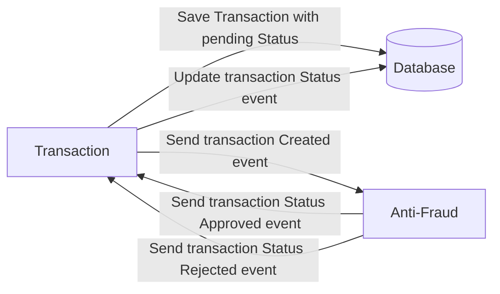

# Yape Code Challenge :rocket:

Our code challenge will let you marvel us with your Jedi coding skills :smile:. 

Don't forget that the proper way to submit your work is to fork the repo and create a PR :wink: ... have fun !!

- [Problem](#problem)
- [Tech Stack](#tech_stack)
- [Send us your challenge](#send_us_your_challenge)

# Problem

Every time a financial transaction is created it must be validated by our anti-fraud microservice and then the same service sends a message back to update the transaction status.
For now, we have only three transaction statuses:

<ol>
  <li>pending</li>
  <li>approved</li>
  <li>rejected</li>  
</ol>

Every transaction with a value greater than 1000 should be rejected.



# Tech Stack

<ol>
  <li>Node. You can use any framework you want (i.e. Nestjs with an ORM like TypeOrm or Prisma) </li>
  <li>Any database</li>
  <li>Kafka</li>    
</ol>

We do provide a `Dockerfile` to help you get started with a dev environment.

You must have two resources:

1. Resource to create a transaction that must containt:

```json
{
  "accountExternalIdDebit": "Guid",
  "accountExternalIdCredit": "Guid",
  "tranferTypeId": 1,
  "value": 120
}
```

2. Resource to retrieve a transaction

```json
{
  "transactionExternalId": "Guid",
  "transactionType": {
    "name": ""
  },
  "transactionStatus": {
    "name": ""
  },
  "value": 120,
  "createdAt": "Date"
}
```

## Optional

You can use any approach to store transaction data but you should consider that we may deal with high volume scenarios where we have a huge amount of writes and reads for the same data at the same time. How would you tackle this requirement?

You can use Graphql;

# Send us your challenge

When you finish your challenge, after forking a repository, you **must** open a pull request to our repository. There are no limitations to the implementation, you can follow the programming paradigm, modularization, and style that you feel is the most appropriate solution.

If you have any questions, please let us know.

# Solucion 
Para manejar el requerimiento se ha creado dos microservicios (transaction-service, status-service).
Ambos se comunicar de manera asincrona a travez de dos Topicos Kafka (transaction-creation-topic, anti-fraud-validation-topic).

El primer microservicio expone dos endpoint, uno para la creacion de la transacion y segundo para listar las transacciones creadas.

El segundo microservicio para evaluar la transaccion apartir del monto (Si el monto es mayor de 1000 el monto es rejectado y si es menor es aceptado).

## Stack Tecnico
- Java 17
- Maven 3.2.0
- Apache Kafka 5.5.3
- Postgres 14
- Spring WebFlux 
- R2DBC Connection
- Lombok

## Instalacion
1. Clonar el repositorio y entrar en la carpeta del proyecto
2. Para iniciar los servicios de postgres, zookeper, kafka corremos el siguiente docker comand
```sh
docker-compose up -d
```
3. Crear el nombre de la base de datos 'transactions_db'
4. Iniciar el microservicio transaction-service (Se iniciara en el puerto 8080)
5. Iniciar el microservicio status-service (se iniciara en el puerto 8081)

## Pruebas
1. Crear una transaccion (La transacion se creara con el estado PENDING, y se enviara al segundo microservicio a travez del topico de kafka para su evaluacion).
```curl
curl --location 'http://localhost:8080/api/v1/transactions' \
--header 'Content-Type: application/json' \
--data '{
    "accountExternalIdDebit":"DEBIT_123_1",
    "accountExternalIdCredit":"CREDIT_123_1",
    "transferTypeId":1,
    "value": 100
}'
```

2. El segundo Microservicio recibe el mensaje y evalua el monto es mayor a 1000 para devolver el estado REJECTED y si el monto es menor a 1000 devolvera APPROVED.

3. Para verificar si se cambio los estados segun la evaluacion, podemos usar el siguiete endpoint (Lista las transacciones creadas)
```curl
curl --location 'http://localhost:8080/api/v1/transactions
```


